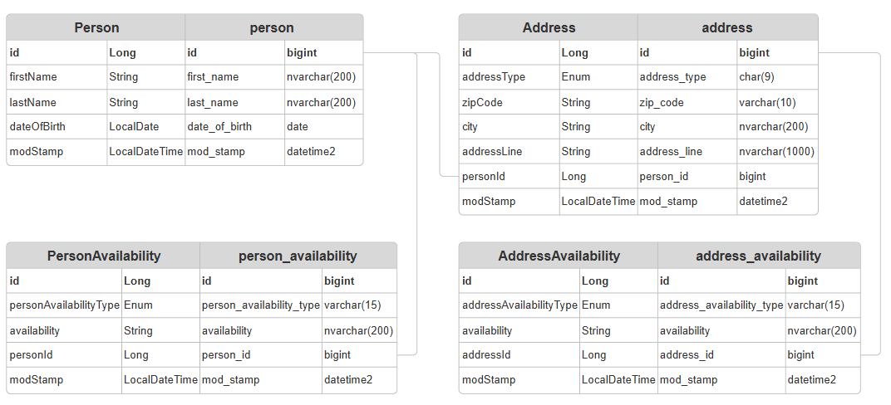

# Personal Registrar

Please update the database connection parameters in application.properties.

### EndPoints

Find persons:
``` url
GET localhost:8080/person?firstName=Nikolett
```
Get person:
``` url
GET localhost:8080/person/{id}
```
Save person:
``` url
POST localhost:8080/person
```
``` json
{
    "id": 1,
    "firstName": "Nikolett",
    "lastName": "Ócsai",
    "dateOfBirth": null,
    "addresses": [
      {
        "addressType": "TEMPORARY",
        "zipCode": "1144",
        "city": "Budapest",
        "addressLine": "Sárkány u. 21",
        "addressAvailabilities": [
          {
            "addressAvailabilityType": "PHONE",
            "availability": "+3611234567"
          }
        ]
      }
    ],
    "personAvailabilities": [
      {
        "id": 1,
        "personAvailabilityType": "EMAIL",
        "availability": "test@test.com"
      }
    ]
  }
```
Delete person:
``` url
DELETE localhost:8080/person/{id}
```

### Data structure:
